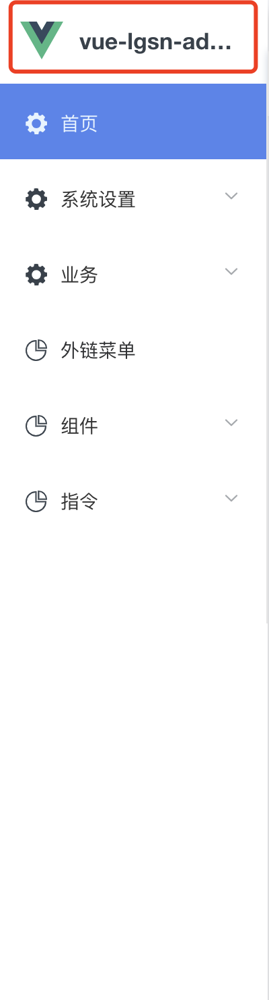

# 应用信息
即为左侧顶部的展示区域。一般用作展示当前应用图标以及名称。



配置:
```javascript:no-line-numbers
//  @/store/modules/baseInfo

state: {
    baseInfo: {
        appName: 'Element-Pro', // 应用名称
        appLogo: 'https://cn.vuejs.org/images/logo.svg' // 应用图标
    }
},

```
