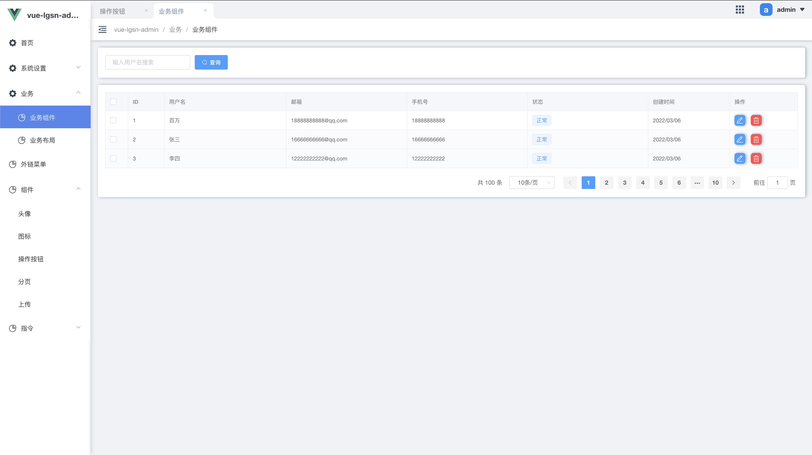

# 表格数据页 
`vue-lgsn-admin` 基于 `element-ui` 把常用的列表页进行封装，以减少重复开发。包含顶部筛选条件、数据列表、底部分页三大功能。

:::tip 提醒
分页组件是 [GPagiation](./gPagination.md)，这样做是为了统一分页的样式。
:::

```js:no-line-numbers
<template>

    <GTableData
        :tableColumn="tableColumn"
        :tableData="tableData"
    >

    <template slot="filter">
        <el-form inline>
            <el-form-item>
                <el-input placeholder="输入筛选条件搜索" />
            </el-form-item>
            <el-form-item>
                <el-button type="primary" icon="el-icon-search">搜索</el-button>
            </el-form-item>
        </el-form>
    </template>

    <template slot="edit">
      <el-button type="primary">查看</el-button>
    </template>

    </GTableData>
</template> 

<script>
    export default{
        data() {
            return {
                tableColumn: [
                    { label: '操作', prop: 'edit', slotTemplate: 'edit' }
                ],
                tableData: [{ name: "张三" }, { name: "李四" }],
            }
        }
    }
</script>
```
### Props

| 参数           | 说明                                                                                              | 类型            | 可选值 | 默认值       |
| -------------- | ------------------------------------------------------------------------------------------------- | --------------- | ------ | ------------ |
| total          | 总条数                                                                                            | Number          | /      | 0            |
| current-page   | 当前页 (支持.sync)                                                                                | Number          | /      | 1            |
| page-size      | 每页条数 (支持.sync)                                                                              | Number          | /      | 20           |
| table-column   | 表头                                                                                              | Array           | /      | []           |
| table-data     | 表格数据                                                                                          | Array           | /      | []           |
| table-loading  | 表格loading                                                                                       | Boolean         | /      | true / false |
| row-key        | 行数据的 Key                                                                                      | String / Number | /      |              |
| expand-row-key | 可以通过该属性设置 Table 目前的展开行，需要设置 row-key属性才能使用。该属性为展开行的 keys 数组。 | Array           | /      |              |

#### tableColumn
| 参数                  | 说明                                                                                                                                            | 类型            | 可选值                 | 默认值 |
| --------------------- | ----------------------------------------------------------------------------------------------------------------------------------------------- | --------------- | ---------------------- | ------ |
| type                  | 对应列的类型。如果设置了 selection 则显示多选框；如果设置了 index 则显示该行的索引（从 1 开始计算）；如果设置了 expand 则显示为一个可展开的按钮 | String          | selection/index/expand | -      |
| prop                  | 对应列内容的字段名                                                                                                                              | String          | -                      | -      |
| label                 | 显示的标题                                                                                                                                      | String          | -                      | -      |
| width                 | 对应列的宽度                                                                                                                                    | String          | -                      | -      |
| align                 | 对齐方式                                                                                                                                        | String          | left/center/right      | left   |
| fixed                 | 列是否固定在左侧或者右侧，true 表示固定在左侧                                                                                                   | string, boolean | true, left, right      | -      |
| show-overflow-tooltip | 当内容过长被隐藏时显示 tooltip                                                                                                                  | Boolean         | -                      | false  |
| slotTemplate          | 自定义单元格展示内容                                                                                                                            | String          | -                      | -      |


### Table Events
| 事件名&emsp;&emsp;&emsp;&emsp;&emsp; | 说明                                                                                                                     | 回调参数                      |
| ------------------------------------ | ------------------------------------------------------------------------------------------------------------------------ | ----------------------------- |
| change-page                          | pageSize/currentPage  改变时会触发                                                                                       | 当页面、每页条数              |
| expand-change                        | 当用户对某一行展开或者关闭的时候会触发该事件（展开行时，回调的第二个参数为 expandedRows；树形表格时第二参数为 expanded） | row, (expandedRows  expanded) |
| selection-change                     | 当选择项发生变化时会触发该事件                                                                                           | selection                     |

### Slot
| name   |             说明             |
| :----- | :--------------------------: |
| filter | 筛选区域，常用来放置筛选条件 |


`完整的例子`
```js:no-line-numbers
<template>
  <GTableData
    :page-size.sync="limit"
    :current-page.sync="page"
    :total="totalPage"
    :table-column="tableColumn"
    :table-loading="tableLoad"
    :table-data="tableData"
    @changePage="getDataList"
    @selection-change="selectionChangeHandle"
  >
    <template slot="filter">
      <el-form
        :inline="true"
        :model="dataForm"
        @keyup.enter.native="getDataList(1)"
      >
        <el-form-item>
          <el-input
            v-model="dataForm.userName"
            placeholder="输入用户名搜索"
            clearable
          />
        </el-form-item>

        <el-form-item>
          <el-button
            :loading="tableLoad"
            @click="getDataList(1)"
            icon="el-icon-search"
            type="primary"
            >查询</el-button
          >
        </el-form-item>
      </el-form>
    </template>

    <!--状态-->
    <template v-slot:status="{ row }">
      <el-tag size="small" :type="row.status === 0 ? 'danger' : ''">
        {{ row.status === 0 ? "禁用" : "正常" }}
      </el-tag>
    </template>

    <!--操作-->
    <template v-slot:operation>
      <GBtnIcon icon="icon-bianji1" />
      <GBtnIcon icon="icon-shanchu1" />
    </template>
  </GTableData>
</template>

<script>
import GTableData from "@/components/GTableData";
import GBtnIcon from "@/components/GBtnIcon";
import { Tag } from "element-ui";
export default {
  name: "index",
  components: {
    GTableData,
    GBtnIcon,
    "el-tag": Tag,
  },
  data() {
    return {
      totalPage: 100,
      page: 1,
      limit: 10,
      dataForm: {
        userName: "",
      },
      tableColumn: [
        { type: "selection", width: 50 },
        { prop: "userId", label: "ID", width: 80 },
        { prop: "username", label: "用户名" },
        { prop: "email", label: "邮箱" },
        { prop: "mobile", label: "手机号" },
        { prop: "status", label: "状态", slotTemplate: "status" },
        { prop: "createTime", label: "创建时间", width: 180 },
        {
          prop: "operation",
          label: "操作",
          width: 150,
          slotTemplate: "operation",
          fixed: "right",
        },
      ],
      tableData: [],
      tableLoad: false,
      dataListSelections: [],
    };
  },
  created() {
    this.getDataList();
  },
  methods: {
    // 获取用户列表
    getDataList() {
      this.tableLoad = true;
      this.setTableInfo({
        list: [
          {
            userId: 1,
            username: "百万",
            email: "18888888888@qq.com",
            mobile: 18888888888,
            state: 0,
            createTime: "2022/03/06",
          },
          {
            userId: 2,
            username: "张三",
            email: "16666666666@qq.com",
            mobile: 16666666666,
            state: 1,
            createTime: "2022/03/06",
          },
          {
            userId: 3,
            username: "李四",
            email: "12222222222@qq.com",
            mobile: 12222222222,
            state: 1,
            createTime: "2022/03/06",
          },
        ],
        totalCount: 100,
      });
    },
    // 设置表格数据
    setTableInfo(data) {
      this.tableLoad = false;
      this.totalPage = data.totalCount;
      this.tableData = data.list;
    },
    // 选择表格中的某项 / 全选
    selectionChangeHandle(val) {
      this.dataListSelections = val;
    },
  },
};
</script>

<style lang="scss">
</style>
```


