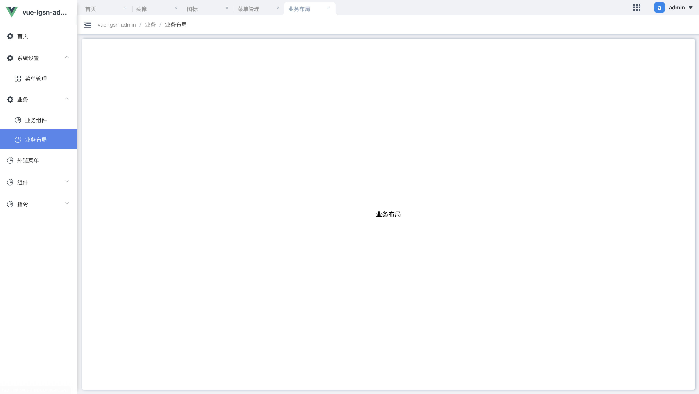

# 业务布局
业务布局主要是为了解决，内容区域在外层的重复布局，例如白色背景，边距、阴影、滚动条。在大部分页面中它总是相同，这就需要在每个页面都重复写入相同的布局代码，当布局变更时这会增加不小的工作量。因此 `vue-lgsn-admin` 抽离了公用部分并封装 ` GViewCard ` 来减少重复部分的代码沉余，同时也能最大程度的维护页面整体布局统一。

它只提供了最外层的页面布局包裹滚动条。

```js:no-line-numbers
<template>
    <GViewCard>
        <div class="center"> 页面布局 </div>
    </GViewCard>
</tempalte>

<script>
import GViewCard from "@/components/GViewCard";
export default {
  components: {
    GViewCard,
  },
};
</script>

<style lang="scss">
.content {
  width: 100%;
  height: 100%;
  display: flex;
  align-items: center;
  justify-content: center;
  font-size: 16px;
  font-weight: bold;
}
</style>
```


