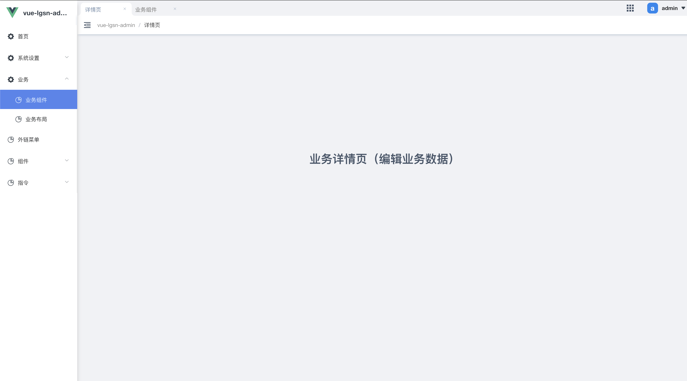

# 详情页
在src/views/下创建新的页面文件

```js:no-line-numbers
  ├── public
  ├── src
  │   ├── assets               # 本地静态资源
  :   :
  │   ├── views                # 页面文件
+ │   │   └── userInfo         # 用户页面文件夹
+ │   │   └──── index.vue      # 用户主页面文件
+ │   │   └──── detail.vue     # 用户详情页面文件
  │   └── main.js              # 应用入口js
  ├── package.json             # package.json
  ├── README.md                # README.md
  └── vue.config.js            # vue 配置文件
```

配置路由

注意一级路由通常用作 layout 布局，因此详情页面需要放到二级路由下。
```js:no-line-numbers
// 为了方便管理，你可以把多个详情放到一个路由下。
// 默认详情配置文件在 /config/config.router.js
{
    name: 'details',
    path: '/details',
    hideMenu: true, // 菜单中隐藏
    children: [
        {
            name: 'businessDetail',
            path: '/businessDetail',
            component: 'business/businessDetail',
            activeMenu: 'business', // 访问该路径时 菜单栏选中某一项 值为 name
            meta: { title: '详情页', 'icon': 'icon-tongjifenxi' },
        }
    ]
}
```



