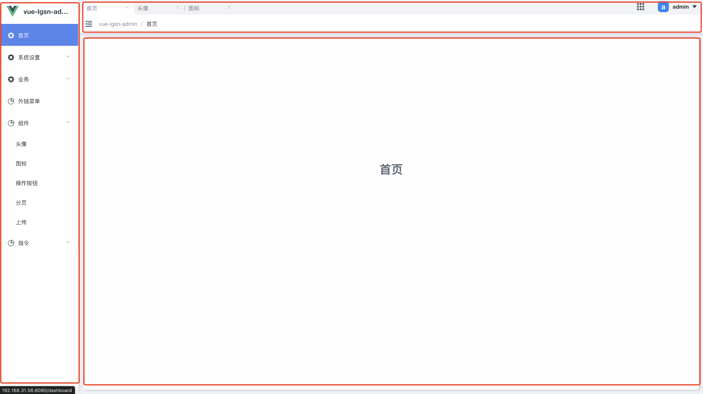

# 布局
布局是一个中后台应用必备的，一个应用整体布局体往往会包含导航栏、菜单、以及内容等。

## layout
`layout` 是项目自带的页面布局，为了使用方便，`vue-lgsn-admin`内部定义为 `layout` 。以下图为例，`layout`分为左侧的菜单栏、顶部的导航栏以内容区域。通常情况下你只需要在内容区域进行业务开发，这会很大程度的提高开发效率。



:::warning 注意
layout 为内部定义使用，在使用新的页面布局或创建新的菜单，你应该避免使用该单词。
:::

#### 修改 layout
找到 `@/layouts` 文件夹，项目自带的layout代码都放在此文件下，你可以在这里添加或者修改`layout`的功能以及样式。

#### 定制 layout
在某些清空下，你可能需要一个新的页面布局。例如一个接口文档页面，layout可能无法满足你的需求。你只需要新建一个布局组件，然后修改一级菜单下的`component`属性为新的布局组件地址。

默认示例: 
```javascript:no-line-numbers
{
  path: '/document',
  name: 'document',
  component: '', // 默认为layout，当使用框架自带布局时，可省略该属性。
  children: [{
    path: 'info',
    component: 'document/info',
    name: 'documentInfo',
    meta: {
      title: '接口文档',
      icon: 'icon-info',
    }
  }]
}
```

更换layout: 
```javascript:no-line-numbers
{
  path: '/document',
  name: 'document',
  component: '/document', // 更改为你需要的布局
  children: [{
    path: 'info',
    component: 'document/info',
    name: 'documentInfo',
    meta: {
      title: '接口文档',
      icon: 'icon-info',
    }
  }]
}
```

## 内容
内容也就是业务展示的区域，通常你只需要在这里进行开发。实现方式是[嵌套路由](https://router.vuejs.org/zh/guide/essentials/nested-routes.html)，因此当你在左侧菜单切换时，只有内容区域变化，内容以外的区域不会收到影响。

```javascript:no-line-numbers
/user/list                    /user/info
+------------------+                  +-----------------+
| User             |                  | User            |
| +--------------+ |                  | +-------------+ |
| | list         | |  +------------>  | |  info       | |
| |              | |                  | |             | |
| +--------------+ |                  | +-------------+ |
+------------------+                  +-----------------+
```
:::tip 提醒
当切换内容区域时，`el-element-pro` 默认带有过渡动画。
<br/>在 `@/layouts/MenuModal/BasicLayoutInline` 中修改过渡效果。
:::
