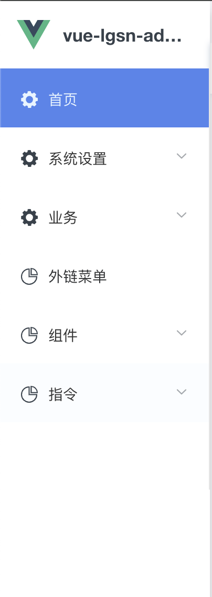
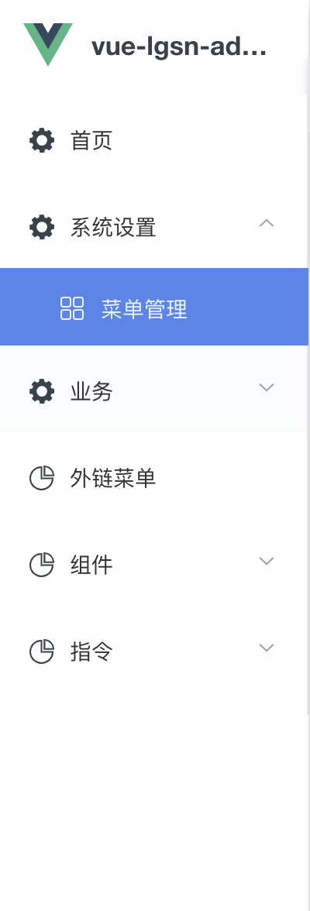
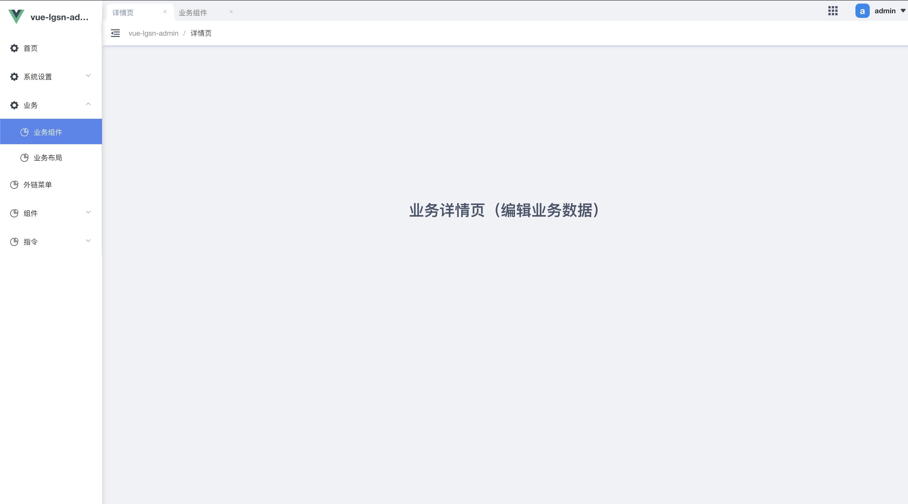

# 路由和菜单 
路由和菜单是组织起一个后台应用的关键骨架。在`vue-lgsn-admin`中菜单是根据路由生成。路由数据可以是静态写入也可以是后端接口返回，或者两者合并使用。

## 配置项
配置项就是路由的属性，在 [vue-router](https://v3.router.vuejs.org/zh/) 的基础上增加额外的属性以及约定一些规则。

```javascript:no-line-numbers
// 当设置 true 的时候该路由不会在侧边栏出现 如详情、编辑等页面
hideMenu: true // (默认 false)

// component 组件地址 注意它是字符串而不是函数
// vue-router 的 component不会生效。
component: '' // 默认为layout

// 是否展示一级菜单
showRoot: true

// 禁止访问 如果为true 页面将会跳转到401
noAccess: true

// 路由元信息
meta: {
  title: '' // 路由标题 必填 用做菜单、标签页等展示名称
  icon: '' // 路由图标

  // 选中菜单 值为选中菜单的 name
  // 例如：你有一个用户详情页，这个菜单设置了 hideMenu，左侧菜单栏中不展示该菜单
  // 但当访问用户详情也时，你希望选中菜单栏目中的用户一栏目，就可以进行设置
  activeMenu: '' // 
}
```
<br/>

示例：
```javascript:no-line-numbers
{
  path: '/menu',
  name: 'menu',
  component: 'layout',
  meta: {
    title: '菜单',
    icon: 'icon-menu',
  },
  children: [
    {
      path: 'list',
      component: 'menu/list',
      name: 'menuList',
      meta: {
        title: '菜单',
        icon: 'icon-menu',
      }
    }
  ]
}
```

### name
name 为必填且必须保证全局唯一。`vue-lgsn-admin` 中是根据 [name](/guide/menu.html#name) 进行路由跳转而不是 [path](/guide/menu.html#name) 。在项目中你也应该遵守这一约定。

### component
为了兼容动态菜单的实现，在注册路由之前，`vue-lgsn-admin` 内部会用 [alias](https://webpack.js.org/configuration/resolve/#resolve-alias) 将 `component` 的路径进行特殊处理。因此配置项的 component 不再是一个函数也就是不支持 `vue-router`中的 component 写法。 额外的你需要保证所有的页面文件都放在 `project-name/src/views/` 文件下。并且 `component` 只填写相对于 `views` 的路径，以防止注册出现问题。

示例: 
```javascript:no-line-numbers
{
  path: '/menu',
  name: 'menu',
  component: 'layout',
  meta: {
    title: '菜单',
    icon: 'icon-menu',
  },
  children: [{
    path: 'list',
    component: 'menu/list',
    name: 'menuList',
    meta: {
      title: '菜单',
      icon: 'icon-menu',
    }
  }]
}
```

:::warning 注意
component: 'layout'，这里的 layout 为项目自带的页面布局，如果使用其他页面布局，这里填写的是组件地址而不是组件名称。
:::


## 路由
`vue-lgsn-admin` 的路由就是[vue-router](https://v3.router.vuejs.org/zh/)，只是对其进行了一些封装。因此你可以使用`vue-router` 的属性和方法。

### 静态路由
静态路由是指像login、404、500等这种无需权限管理。 `@/config/router.config.js` 中进行配置。

:::tip 提醒
考虑静态路由可能也需要在菜单中展示，因此静态路由会和动态路由合并之后在注册。如有额外的业务需求，请找到 `@/store/module/permission` 查看并修改逻辑。
:::

### 动态路由
`vue-lgsn-admin` 在 `@/permission` 中以 `userInfo` 模拟接口的方式获取路由数据，通过 `addRoute` 方式实现动态加载路由。

你只需要替换 `permission/generateRoutes` 中传入的数据即可。
```javascript:no-line-numbers
// 模拟接口方式 路由数据
// vue-lgsn-admin 是通过 getUserInfo 方法获取数据
// 你也可以修改这里的逻辑
const responseRouters = await store.dispatch('getUserInfo')

// 替换 responseRouters 数据即可
const routes = await store.dispatch('permission/generateRoutes', responseRouters)
```
:::tip 提醒
所有的路由逻辑都放在 @/permission
:::

## 菜单
在 `vue-lgsn-admin`中，会根据你的路由配置自动生成。值得注意的是，简洁的路由应该保持在两级嵌套，如果还有下级，你应该通过详情页等其他途径来解决。

:::tip 提醒
`@/layouts/MenuModal/BasicMenu` 对应菜单功能实现。
:::

### 一级菜单
受 `layout` 布局影响，layout菜单配置都是由两级嵌套组成。因此 `vue-elment-pro` 会把那些只有一个子级的路由识别为一级菜单。这意味着在菜单栏中只会展示子菜单，父菜单将会被隐藏。如果你需要展示一级菜单，请在一级菜单下添加 `showRoot`。

默认：



```javascript:no-line-numbers
// 菜单栏只会展示 菜单列表
// 菜单管理会被忽略
{
  path: '/menu',
  name: 'menu',
  meta: { title: '系统设置' },
  children: [
   {
      path: 'setting',
      component: 'menu/index',
      name: 'setting',
      meta: {
        title: '菜单管理',
        icon: 'icon-menu',
      },
      children: [] // 你可以在这里继续配置下级菜单
    }
  ]
}
```

展示一级菜单：



```javascript:no-line-numbers
{
  path: '/menu',
  name: 'menu',
  meta: { title: '系统设置' },
  children: [
   {
      path: 'list',
      component: 'menu/index',
      name: 'menuSetting',
      meta: {
        title: '菜单管理',
        icon: 'icon-menu',
      },
      children: [] // 你可以在这里继续配置下级菜单
    }
  ]
}
```

:::tip 提醒
如果你的一级菜单component 为 layout, 可以忽略该属性。但注意子级菜单的 component 不能忽略。
:::


### 多级菜单
多级菜单的层级根据 `children` 属性生成。理论上可以无限嵌套。

示例：
```javascript:no-line-numbers
{
  path: '/menu',
  name: 'menu',
  children: [
   {
      path: 'setting',
      component: 'menu/index',
      name: 'menuSetting',
      meta: {
        title: '菜单',
        icon: 'icon-menu',
      },
      children: [] // 你可以在这里继续配置下级菜单
    }
  ]
}
```

### 图标
`vue-lgsn-admin` 中图标使用的是 [iconfont](https://www.iconfont.cn/) 的 [symbol 引用](https://www.iconfont.cn/help/detail?spm=a313x.7781069.1998910419.d8cf4382a&helptype=code)，项目在 `@/styles/global.css`中已加入通用CSS代码，JS文件在 `@/utils/proicon`。并对图标对使用进行了封装 [组件 - 图标]()。

你只需在 `main.js`中引入你的图标JS文件，在 `meta.icon`中填写对应类名。
```javascript:no-line-numbers

{
  path: '/menu',
  name: 'menu',
  icon: 'icon-menu',  // 图标
  children: [
   {
      path: 'list',
      component: '/menu/index',
      name: 'menuList',
      meta: {
        title: '菜单',
        icon: '', // 图标
      },
      children: [] // 你可以在这里继续配置下级菜单
    }
  ]
}
```
:::tip 提醒
一级菜单的 `icon` 通常不会出现在菜单中，更多的是用来作为容器使用。因此你可以省略。
:::

通常情况下，项目图标你应该新建一个JS文件，并在 `main.js`中引入单独管理。如果你和框架自带图标统一管理，请查阅 [组件 - 图标]()。

### 外链
你也可以在菜单中配置一个外链，只要你在 path 中填写了合法的 url 路径。
```javascript:no-line-numbers
{
  path: 'https://element.eleme.cn/',
  name: '/element'
}
```
### 默认菜单
`vue-lgsn-admin` 在注册路由之前，会获取第一个可访菜单作为项目的默认访问地址。如果你想指定这个地址，找到 `@/store/modules/permission` 下的 `generateRoutes`

```javascript:no-line-numbers
//  @/store/modules/permission

// 修改 defaultPath
commit('setIsGetMenu', { routes, defaultPath, flag: true })

```

### 菜单权限
如果你给菜单添加了 noAccess 属性，菜单栏中将会过滤掉该菜单项目。即便通过url访问，同样会被拦截到 [401](/guide/permission.html#_401)。

### 隐藏菜单
当菜单不需要在菜单栏中展示，同时需要可以正常访问，可以参考此示例。通常用来创建类型详情页。
例如：添加一个菜单详情页面，访问这个页面同时选择左侧菜单栏中的菜单管理。
```javascript:no-line-numbers
// 详情页同样需要放到 layout 布局下。
// 为了方便管理，你可以把多个详情放到一个路由下。
{
    name: 'details',
    path: '/details',
    hideMenu: true, // 菜单中隐藏
    children: [
        {
            name: 'menuDetail',
            path: '/menuDetail',
            component: 'business/menuDetail',
            activeMenu: 'menu', // 访问菜单 选中菜单栏中某一项 值为 name
            meta: { title: '详情页', 'icon': 'icon-tongjifenxi' },
        }
    ]
}
```

