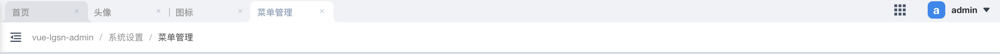
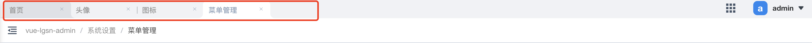
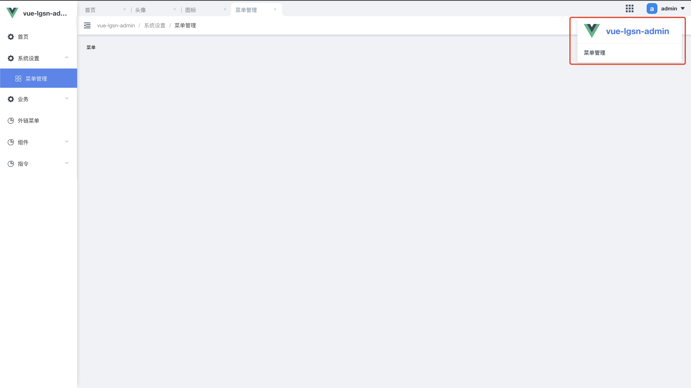

# 导航栏
即为页面顶部的区域。分为标签页、快捷导航、账户信息、面包屑导航。



### 标签页
标签页用作记录用户访问过的页面，目的是为了减轻用户在切换菜单时的交互操作及提供刚快捷的菜单入口。标签页最少会保留一个，因此当标签栏只有一个时它将不能被删除。



标签页是没有缓存机制的，这意味用户刷新页面标签栏会清空并自动添加当前访问的标签栏。如果你想保留标签页，请修改以下逻辑：

```javascript:no-line-numbers
// @/layouts/MenuModal/BasicLayoutInline

// 找到以代码
// 修改 tags 的存储逻辑
<NavTags :current-tag="currentTag" :tags="tagViews" @delTag="delTag" />
```

### 快捷入口
你可用它展示那些用户高频率访问的菜单地址，或者在这里展示其他应用的访问地址。分为当前项目和入口列表。当前项目主要为了用户更快捷放回首页。展示信息即为[应用信息](/guide/appInfo.html)中的配置。

入口列表配置:
```javascript:no-line-numbers
// @/stotre/modules/baseInfo

// 修改 quickAppLinks 的数据
state: {
    quickAppLinks: [
        { 
            title: '菜单管理', // 名称
            link: '/menu' // 跳转地址 在当前应用中的路由地址 | 外部链接
        }
    ]
},
```



:::tip 提醒
对应代码在 `@/layouts/component/quickSwitch`
:::

### 账号信息
展示当前登录账号头像、昵称，并带有修改密码、退出登录的下拉菜单。[组件 - 头像]()

账号配置:
```javascript:no-line-numbers
// @/stotre/modules/userInfo

const actions = {
    async getUserInfo({ commit }) {
        return new Promise((resolve) => {

            // 修改传入的数据
            commit('userInfo', {
                'avatarImg': '', // 用户头像
                'userName': 'admin' // 昵称
            })
        }
    }
}

```

<br/>展示/关闭 修改密码弹框：
```javascript:no-line-numbers
// 在你的代码中调用
this.$store.dispatch('baseInfo/editPwd', true / false)
```


:::tip 提醒
调用逻辑请查阅 `@/permission`
:::

### 面包屑导航
使用 `element-ui` 的 [Breadcrumb](https://element.eleme.cn/#/zh-CN/component/breadcrumb)

:::tip 提醒
代码地址 `@/layouts/menuModule/BasicLayoutInline`
:::

