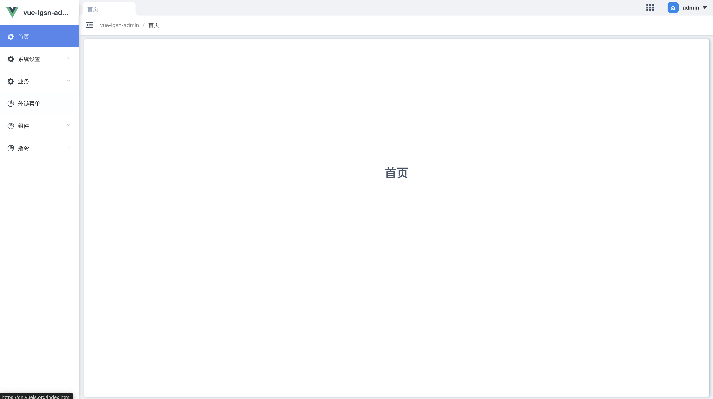
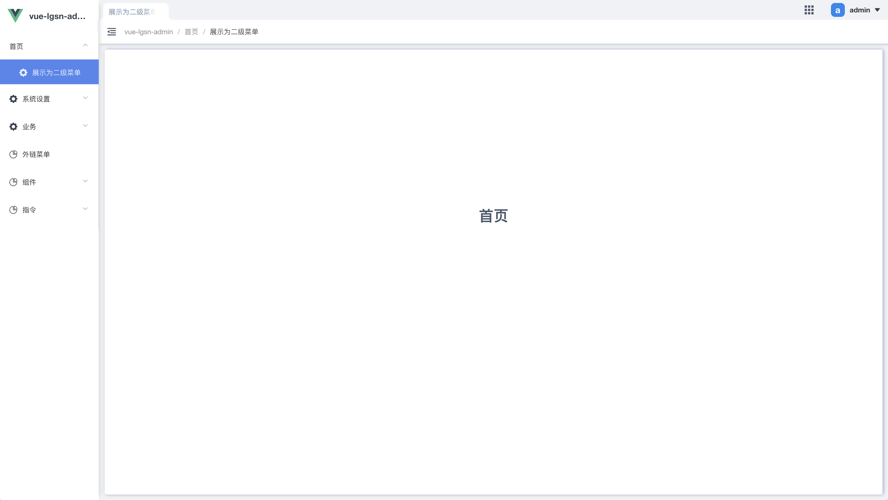

# 新增页面
在src/views/下创建新的页面文件

```js:no-line-numbers
  ├── public
  ├── src
  │   ├── assets               # 本地静态资源
  :   :
  │   ├── views                # 页面文件
+ │   │   └── domePage.vue      # 新页面文件
  │   └── main.js              # 应用入口js
  ├── package.json             # package.json
  ├── README.md                # README.md
  └── vue.config.js            # vue 配置文件
```

配置路由

注意一级路由通常用作 layout 布局，因此新页面需要放到二级路由下。
```js:no-line-numbers
{
  name: 'Dashboard',
  path: '/Dashboard',
  children: [
      {
          name: 'dashboard',
          path: '/dashboard',
          component: 'dashboard',
          meta: { title: '首页' },
      }
  ]
}
```


该路由下只有一个子级，所以这里会展示为一级菜单。如果你想展示二级：
```js:no-line-numbers
// 添加 showRoot
{
  name: 'Dashboard',
  path: '/Dashboard',
  showRoot: true,
  meta: { title: '首页' },
  children: [
      {
          name: 'dashboard',
          path: '/dashboard',
          component: 'dashboard',
          meta: { title: '展示为二级菜单' },
      }
  ]
}

// 或者添加子级
{
  name: 'Dashboard',
  path: '/Dashboard',
  children: [
      {
          name: 'dashboard',
          path: '/dashboard',
          component: 'dashboard',
          meta: { title: '首页' },
      },
      {
          name: 'casePage',
          path: '/casePage',
          component: 'casePage',
          meta: { title: '案例' },
      }
  ]
}
```



